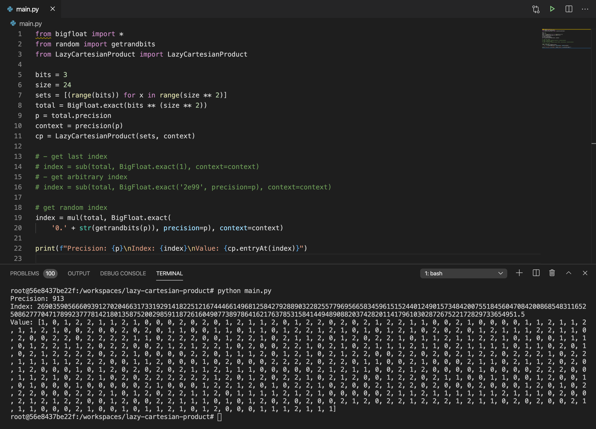

# (Big) Lazy n-ary Cartesian Product

### Concept

Lazy Cartesian product: [Iterating combinations of arrays / sets without calculating them all first](http://phrogz.net/lazy-cartesian-product).

### Implementation

Uses the `bigfloat` package to fix issues with Python's floating-point division algorithm, which fails to work above a certain -very high- number.  
This allows you to generate a Cartesian product of gargantuan size.

The implementation is based on [this article](https://hackernoon.com/generating-the-nth-cartesian-product-e48db41bed3f).

### Usage

Either:

- Start a [dev container](https://code.visualstudio.com/docs/remote/containers-tutorial)  
   Run `python main.py`
- (TODO) Install with pip

